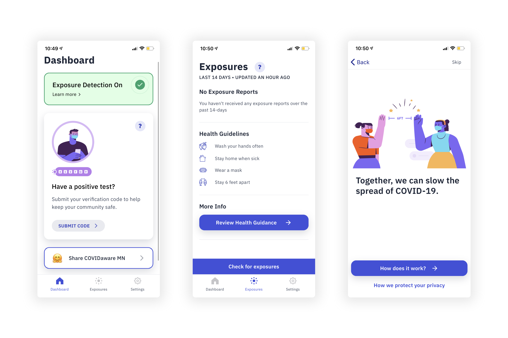

[PathCheck](https://www.pathcheck.org/) is a nonprofit foundation dedicated to
fighting COVID-19. They hired thoughtbot to help build a cross-platform mobile
app leveraging the Google Apple Exposure Notification (GAEN) protocol.

Through thoughtbot, I worked with PathCheck for several months, contributing
heavily to the app's interface design as well as the React Native/TypeScript
codebase. The app launched in several jurisdictions worldwide including
Minnesota, Guam, Cyprus, Hawaii, Louisiana, and Alabama.

The [COVIDAware MN
app](https://apps.apple.com/us/app/covidaware-mn/id1519107779), which launched
when we at thoughtbot were still contributing to the project, maintains 4.7
stars on the Apple App Store with over 400 ratings.

My contributions to the project are public on the [PathCheck
GitHub](https://github.com/Path-Check/gaen-mobile/commits?author=devinjameson).
