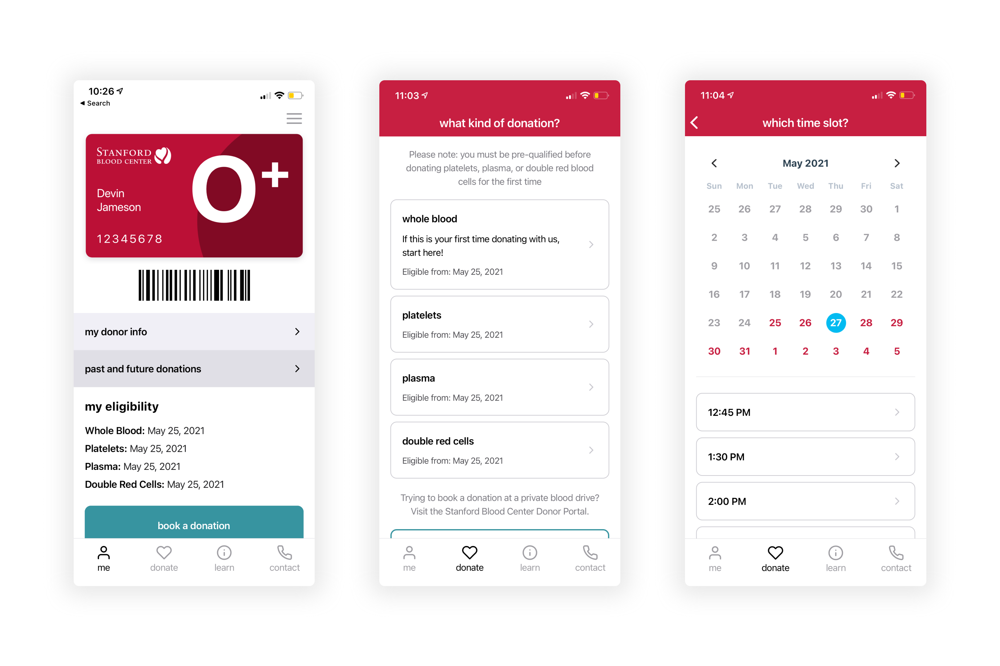

[Stanford Blood Center](https://stanfordbloodcenter.org/) is a blood donation
organization. They hired thoughtbot to help them design and build a mobile app
to improve the donation experience.

We started with a product design sprint to decide on an MVP roadmap. We then did
several weeks of development with React Native and TypeScript, culminating in
releases to the [Apple App
Store](https://apps.apple.com/us/app/stanford-blood-center/id1551873665) and
[Google Play
Store](https://play.google.com/store/apps/details?id=com.stanfordbloodcenter).
